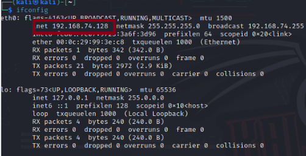

# Kioptrix Level 1 Writeup

İlk olarak zafiyetli makinemizi indirip WMware sanal makinemize kuruyoruz. Atak yapabilmemiz için zafiyetli makine ve bizim makinemizin aynı ağda olması gerekiyor. Bu yüzden iki makineyi de  network adapter kısmından  NAT da başlatıyoruz. Böylece iki makine de aynı ağda olacaktır.

# Enumeration

## **1- Zafiyetli makine ve kendi makinemizin IP adresini bulma**

Kendi IP Adresimiz: 192.168.74.128

Zafiyetli Makinenin IP Adresi: 192.168.74.129

Bunu yaptıktan sonra öncelikle ifconfig komutuyla kendi makinemizin IP adresini öğreneceğiz. 

IP adresimizi 192.168.74.128 olarak bulduk. Bu IP adresini de kullanarak netdiscover -r komutuyla indirdiğimiz zafiyetli makinenin IP adresine ulaşacağız (netdiscover -r 192.168.74.0/24).

(netdiscover komutunu kullanabilmek için root olmamız gerekiyor.)

Burada MAC adreslerini baz alarak  zafiyetli makinenin IP adresini 192.168.74.129 olarak bulduk daha sonra nmap -A komutuyla makine hakkında detaylı bilgiler elde edeceğiz. 

Buradaki sonuçlarda ssh, http, netbios, ssl/https portları açık.  Burada açık olan portların zafiyetlerini aramak için tek tek msfconsole üzerinden tarama yaparız. Ben aramayı samba servisi ile başlattım.

Detaya inmem gerekirse msfconsole içinde search komutunu kullanarak, Metasploit Framework’ünün veritabanında “samba” servisi ile ilgili modüllerin ve exploitlerin taramasını yaptık.

Burada dikkat edeceğimiz husus linux kullandığımız için tarama sonucu gelenlerden linux tabanlı olanlarını seçmektir.

Yukarıda linux tabanlı bir exploit bulduk.  Use 22 komutuyla bu exploite sahip olabiliriz. Daha sonra da options yazarak bu exploit için gerekli olan bilgilere bakacağız ve eksik yerleri uygun bir şekilde dolduracağız.

Burada RHOSTS yazan yer zafiyetli makinenin bilgilerini içerirken LHOST yazan yer ise atak yaptığımız makinenin bilgilerini içerir. Exploit target kısmı da bize sambanın versiyonu ve atak içeriği hakkında bilgi verir. 

Burada ilk olarak RHOST yazan kısımdaki boşluğa set RHOSTS komutuyla zafiyetli makinenin IP adresini gireceğiz. Sonra tekrar options yazarak bakabiliriz.

Daha sonra Payload options kısmındaki ters bağlantıyla iki makine arasında kabuk oluşturarak sızmaya çalışacağız. Bu komut içinse set payload linux/x86/shell_reverse_tcp komutunu kullanacağız. Bu komut sonrasında artık Bruteforce atağı için gereken payloada sahibiz. run komutuyla Bruteforce atağını deneyerek karşı taraftan shell almaya çalışacağız.

Yukarıda görüldüğü üzere atakla shelleri aldık. Daha sonra whoami komutuyla zafiyetli makinede hangi yetkide olduğumuza bakabiliriz. 

Yukarıda da görüldüğü üzere root yetkisiyle zafiyetli makineye sızmayı başardık.